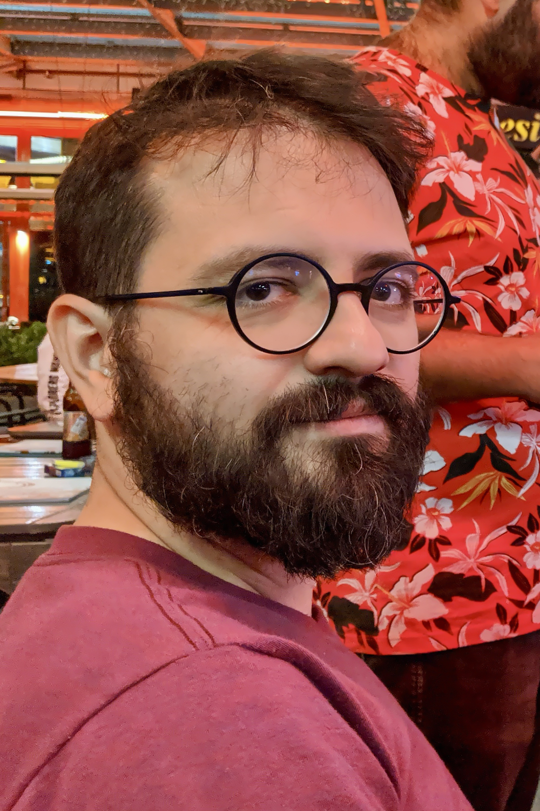
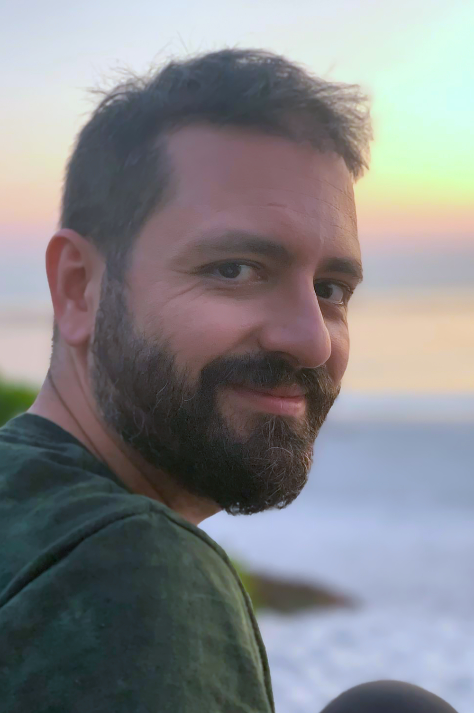

import Icon from "./src/components/Icon.astro";
import logoMetu from "./logo-metu.svg";
import logoTubitak from "./logo-tubitak.svg";
import logoGoogle from "./logo-google.svg";
import logoMeta from "./logo-meta.svg";
import logoRoka from "./logo-roka.svg";

Innovator, Tech Visionary, and Community Builder

Welcome to my digital home. I am Tugrul Ates, a seasoned technologist, entrepreneur, and an ardent advocate for purposeful innovation. My journey in the tech world spans over a decade, with pivotal roles at giants like Google and Meta, and now, at the helm of my ventures: Roka Software and Ates Ventures.

|                             Where?                             | What?                                                                                                                                           |
| :------------------------------------------------------------: | :---------------------------------------------------------------------------------------------------------------------------------------------- |
|    <Icon src={logoMetu} alt="METU logo" className="w-24" />    | I have studied at **Middle East Technical University** from _2003 to 2007_. I have a Master's degree in electrical and electronics engineering. |
| <Icon src={logoTubitak} alt="TUBITAK logo" className="w-24" /> | I was a researcher at **TUBITAK** from _2006 to 2011_.                                                                                          |
|  <Icon src={logoGoogle} alt="Google logo" className="w-24" />  | I worked at **Google** as a software engineer from _2011 to 2017_.                                                                              |
|    <Icon src={logoMeta} alt="Meta logo" className="w-24" />    | I worked at **Meta** as a software engineer from _2017 to 2021_.                                                                                |
|    <Icon src={logoRoka} alt="Roka logo" className="w-24" />    | I am running a software company since _2023_.                                                                                                   |

My Philosophy: Life is a canvas for building impactful and transformative solutions. I believe in harnessing technology not just for technological advancement, but to enrich lives, uphold digital privacy, and foster communities.

My Career: My path in the tech landscape has been diverse and enriching. From developing essential features for the Facebook mobile app to driving innovation at Google Play and Stadia, I have always been at the forefront of tech evolution. I am a builder at heart - whether it's software, teams, or communities. My expertise lies in software design, engineering management, data analytics, and AI/ML, but it's my passion for mentorship and community building that truly defines my work.

Roka Software & Ates Ventures: The genesis of my entrepreneurial journey was the desire for autonomy - to create platforms and solutions that resonate with my ethos. Roka Software is a testament to this, aiming to personalize digital experiences with AI-driven tools, while ensuring user privacy and digital well-being. Ates Ventures, my consulting firm, is an extension of my commitment to nurturing tech talent and guiding businesses with data-driven strategies and user-centric designs.

Community Engagement: Beyond my ventures, I am deeply involved in the tech community. As a speaker, mentor, and thought leader, I am dedicated to sharing my knowledge, fostering innovation, and inspiring the next generation of tech enthusiasts.

Life Beyond Work: When I am not engrossed in technology, I am an avid traveler, a connoisseur of cultures, and a lifelong learner. These experiences enrich my perspective, enabling me to see beyond the binaries of code into the diverse spectrum of human experience.

Join Me: As I continue on this journey of innovation and impact, I invite you to join me. Whether you're a budding entrepreneur, a tech enthusiast, or someone passionate about making a difference, there's a story here for you. Let's connect, collaborate, and create a future that resonates with our collective aspirations.

|   Geeky Tugrul    |   Dreamy Tugrul   |
| :---------------: | :---------------: |
|  |  |
