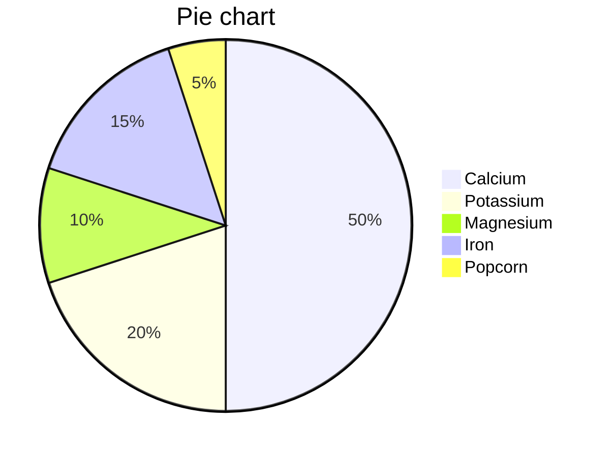
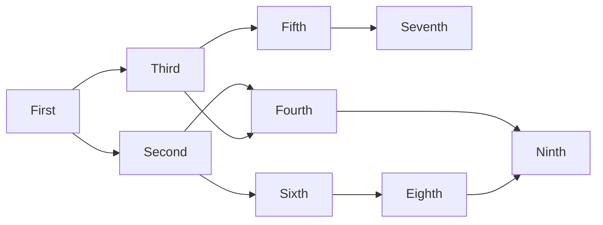
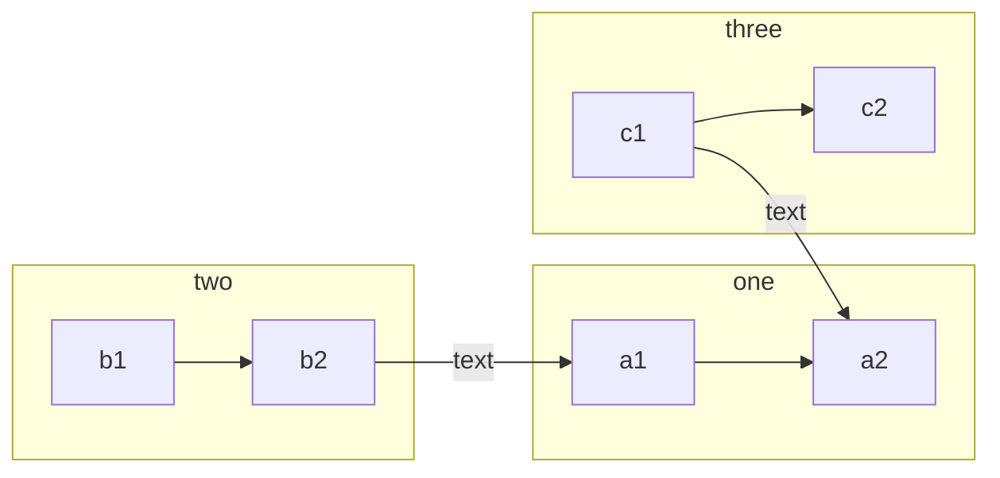

Testing build and formatting with this post. The paragraph is intentionally kept longer than seemingly necessary. This is needed to show how the summaries would look like.

## Example formatting

### Text

This is a text with _italic_, **bold** and `code` words.

### Links

This is a link to another post on the site: [About](About.md) or [[Test post]]

This is a link to another site: [GitHub](https://github.com/)

### Blockquotes

> This is a blockquote. But don’t quote me on that.

> This is a nested blockquote.
>
> > This is the inner part.

### Footnote

This is a comment with a footnote. [^1] This sentence has another footnote whose definition is at the end of the document. [^2]

This is yet another one. [^3]

[^1]: This is the footnote.

### Markdown code

```python
"""This is a comment."""
def func(x):
    for i in range(x):
        print(i)

if __name__ == '__main__':
    func(10)
```

```javascript
function switchLight() {
  const theme = $("html").css("--light") > 0.5 ? "dark" : "light";
  console.log(theme);
  $("html").attr("data-theme", theme);
  $("html").css("--light", "");
  setPref({ theme: theme, light: null });
  updateLightIcon();
  updateInputs();
  // TODO: #13 Switch graph theme with page
  // if (window.mermaid !== null) {
  //     window.initializeGraph();
  // };
}
```

### Table

|   Center   | Left         |
| :--------: | :----------- |
| first key  | first value  |
| second key | second value |
| third key  | third value  |

### Tags

These are tags: #coding #blog

### Math

The value of $\pi$ is close to $4$.

$\pi$ is equal to $\sqrt{-1}$.

$$x_{1,2} = \frac{-b \pm \sqrt{b^2-4ac}}{2b}$$

I have $500, but I need $200 more.

I can still escape the \\$ sign.

This is two dollars sign $$ and I like it $$.

### Graph







### Lists

#### Unordered lists

- one
- two
- three

#### Ordered lists

1. one
2. two
3. three

### Images

[^2]: Hey, you found me!

![[../photos/sphere-of-perfection.jpg]]

### Header 3

#### Header 4

##### Even more header

###### Is this header enough?

Maybe.

[^3]: Howdy!
