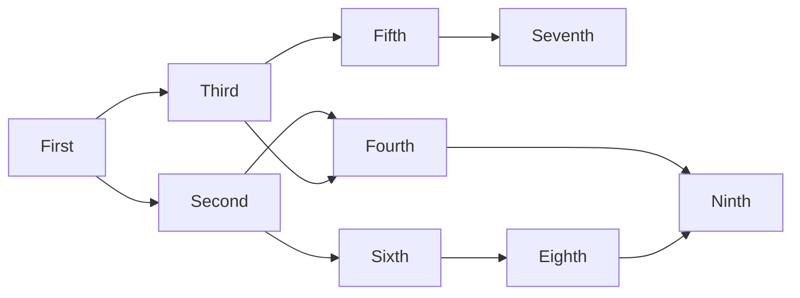

# Test post

Testing build and formatting with this post.

## Example formatting

### Text

This is a text with *italic*, **bold** and `code` words.

### Links

This is a link to another post on the site: [About](/about)

This is a link to another site: [GitHub](https://www.github.com)

### Blockquotes

> This is a blockquote. But don’t quote me on that.

> This is a nested blockquote.
>> This is the inner part.

### Footnote

This is comment with a footnote [^1].

[^1]: This is the footnote.

### Markdown code

```python
for i in range(10):
    print(i)
```

### Jekyll code


for i in range(10):
    print(i)


### Table

| Center       | Left         |
| :----------: | :----------- |
| first key    | first value  |
| second key   | second value |
| third key    | third value  |

### Tags

These are tags: #coding #blog

### Math

$x_{1,2} = \frac{-b \pm \sqrt{b^2-4ac}}{2b}$

### Graph



### Lists

#### Unordered lists

- one
- two
- three

#### Ordered lists

1. one
2. two
3. three

#### Check lists

- [X] one
- [ ] two
- [ ] three

### Images


